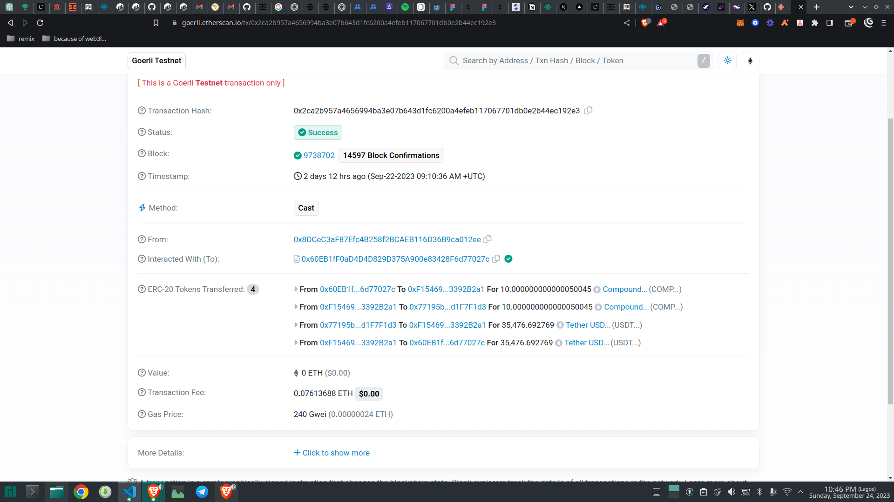
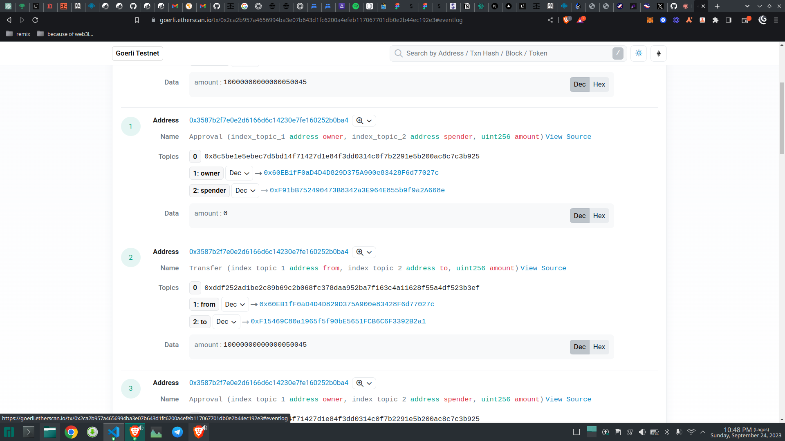
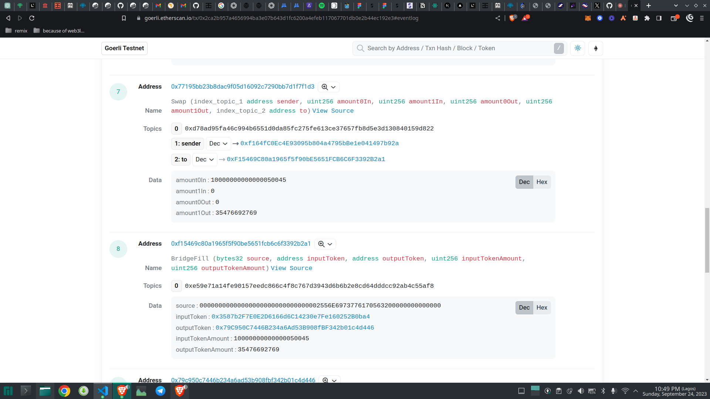

### Documentation

### Variables
    - buyToken: is the token address for the token to be exchanged.
    - sellToken: address is the address of the token swapped for.
    - takerAddress: is the msg.sender address
    - instaAccountAddress: is the child contract address generated from the  factory on calling the build function.
    - by: is generated when 0x Api is being called. this needs to be generated with a script.

    - sellAmount: This is the amount needed to be exchanged for the buyAmount.
    - buyAmount: This needs to be generated with a script also.

### Function Calls

    - encodedFunctionCall: This generates the bytes passed into the cast function

    ```
    Transaction Hash => 0x2ca2b957a4656994ba3e07b643d1fc6200a4efeb117067701db0e2b44ec192e3
    ```



    The image above shows when the cast function is being called.



    Calling the cast function, it calls the approval function, transfer function and the swap function of 0x protocol.




### Conclusion

In conclusion, interacting with 0x protocol connector contract with scripts basically by calling the cast function which relayed to other functions like the approval function as stated in the 0x protocol documentation.
